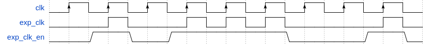

# Experiment Setup Component

The experiment experiment setup component speficication defines the entity interface for wrapped experiment setup logic, such that it is capable of interfacing with the controller. 

## Interface

```
              ______________
       clk ->|              |
   exp_clk ->|              |
exp_clk_en ->|  Experiment  |
     reset ->|  Setup       |
      addr ->|  Component   |
       din ->|              |-> dout
       wen ->|______________|
       
```

 - `clk` is defined to be a `std_logic` input signal carrying the global clock signal. This signal is only to be utilized in experiment setup wrapping logic.
 - `exp_clk` is defined to be a `std_logic` input signal carrying the experiment setup's clock signal.
 - `exp_clk_en` is defined to be `std_logic` input signal carrying a signal indicating whether the `exp_clk` will be enabled during the current global clock cycle. This signal is only to be utilized in experiment setup wrapper logic. The timing diagram below displays the relationship between `clk`, `exp_clk` and `exp_clk_en`.



 - `reset` is defined to an a `std_logic` input signal carrying a signal indicating whether the experiment setup component should be reset to its initial state.
 - `addr` is defined to be a `std_logic_vector` input signal of width `ADDR_WIDTH`. This signal serves as the address bus for the experiment setup wrapper logic.
 - `din` is defined to be a `std_logic_vector` input signal of width `DATA_WIDTH`. This bus serves as a means to set the data to be written.
 - `wen` is defined to be a `std_logic` input signal that carries a signal indicating whether the value set on the `din` bus should be written to the address set on the `addr` bus.
 - `dout` is defined to be a `std_logic_vector` input signal of width `DATA_WIDTH` that carries the signal read from the address set on the `addr` bus.
 
The experiment setup interface is parameterized through the `DATA_WIDTH` and `ADDR_WIDTH` parameters. These indicate the widths of the experiment setup component's address and data buses, respectively. 

## Read-Write Behaviour
The experiment setup component interface is based on that of a single-port block ram logic element and is prescribed to behave like such an element operating in write-first mode. This means that an experiment setup component should only update its `dout` signal value on rising clock edges.