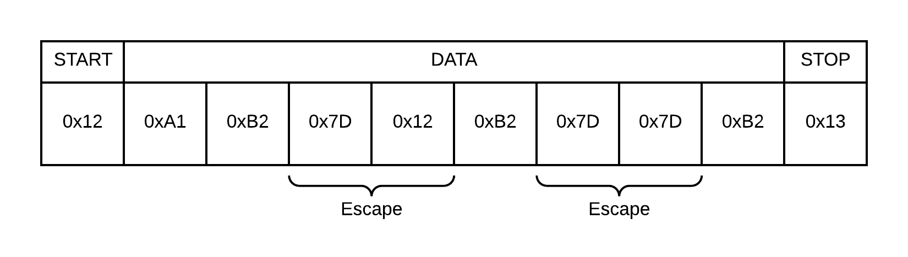

# `serial` Communication Protocol

The `serial` communication protocol describes a method for establishment of a virtual point-to-point connection between PC software and the *controller* through a (virtual) serial port. In terms of the OSI model, this protocol existst in the physical layer as well as the data-link layer. The application layer of the communication stack is described separately in an *interaction protocol*. 

## Protocol Parameters
**UART Baud Rate** defines the speed at which the UARTs operate. The property identfier is defined as `baud-rate`. The parameter value is defined to limited to standard baud rates: 110, 150, 300, 1200, 2400, 4800, 9600, 19200, 38400, 57600, 115200, 230400, 460800 & 921600. 

## Physical Layer
On the physical layer, a [UART](https://en.wikipedia.org/wiki/Universal_asynchronous_receiver/transmitter) is responsible for the transmission of bytes.
- 1 start bit
- 1 stop bit
- 8 data bits
- no parity
- no flow control

## Data-Link Layer
UARTs typically handle byte-sized units. In order to support the transmission and reception of larger units of data, a simple data-link layer has been implemented in order to define a data frame. To minimize the complexity of the implementation, the decision was made to provide an unacknowledged and connectionless service. In order to identify individual frames of data, character stuffing is used. Specific byte values are assigned to flag a frame’s start and end. An escape character is used to prevent frame data to be identified as a control character. Character `0x12` is used as a start flag, `0x13` as a stop flag and `0x7D` is used as escape character. Bytes are transmitted in big-endian order. The following image displays an example data frame:
 

